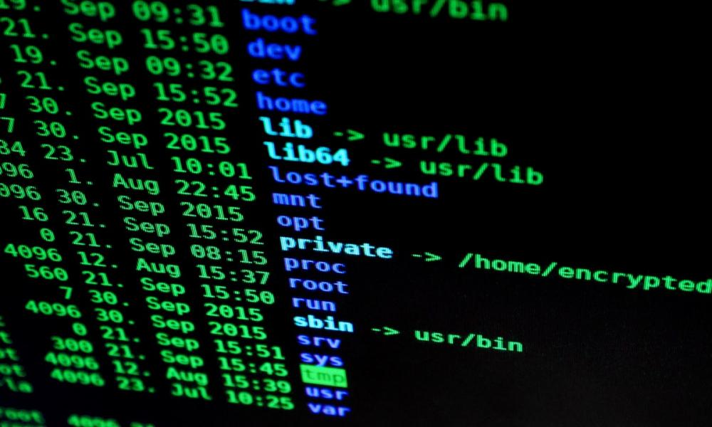

<style>
footer {
  color: #35FF69;
}
ul {
  list-style: none;
}
ul li::before {
  content: "\2022";
  color: #F96900;
  font-weight: bold;
  display: inline-block;
  width: 1em;
}
</style>

# Obsługa terminala Linux

Borys Łangowicz

--- 
<!-- _class: lead -->


# Co to jest Linux?


---
<!-- Krótka historia #TODO -->


---
<!-- Dystrybucje #TODO -->


---
<!-- Jak wiele ich jest wg. truelist.co -->
<!-- Linux'a łatwo modyfikować -->
<!-- _class: lead -->
# Ponad 600 rozwijanych dystrybucji


---
<!-- Żarty -->


---
<!-- Realne zastosowania - docker -->


---
<!-- Sailfish OS -->


---
<!-- Android -->


---
<!-- Dlaczego warto się go nauczyć - zastosowania -->
# Ale kto tego używa?
* Wszystkie spośród 500 najmocniejszych superkomputerów
* 85% smartfonów
* 96.3% z 1 000 000 topowych webserwerów
* Około 90% spółek z Fortune 500
---
<!-- Łączanie się z serwerem-->

1. Przy użyciu ssh
  ```bash
  ssh użytkownik@edu.halpress.team
  ```

2. Putty

  * Wybieramy SSH Access
  * Server IP Address: edu.halpress.team
  * SSH port: 22
  * SSH username: nazwa użytkownika
  * SSH password: hasło

---
<!-- Podstawowe komendy #TODO-->
<!-- _class: lead -->
# Podstawowe komendy


---

## Poruszanie się

```bash
cd # przejście do innego katalogu
ls # pokazywanie zawartości katalogu
pwd # pokazywanie ścieżki do obecnego katalogu
mkdir # tworzenie katalogu
~ = /home/user
``` 
Przykłady
```bash
cd ~
cd ../..
ls /home/user
mkdir katalog
pwd
```

---

## Argumenty/parametry
```bash
ls -l --all
ls -la
```

```
total 144
drwxrwxr-x  4 neloduka_sobe neloduka_sobe   4096 lut 26 01:29 .
drwxrwxrwx 27 neloduka_sobe neloduka_sobe   4096 lut 20 20:15 ..
-rw-rw-r--  1 neloduka_sobe neloduka_sobe    529 lut 26 01:26 copying_demo.html
drwxrwxr-x  8 neloduka_sobe neloduka_sobe   4096 lut 21 22:21 .git
drwxrwxr-x  2 neloduka_sobe neloduka_sobe   4096 lut 26 14:21 graphics
-rw-rw-r--  1 neloduka_sobe neloduka_sobe    189 lut 21 22:20 Makefile
-rw-rw-r--  1 neloduka_sobe neloduka_sobe     55 lut 20 20:15 README.md
-rw-rw-r--  1 neloduka_sobe neloduka_sobe 107865 lut 27 09:01 slides.html
-rw-rw-r--  1 neloduka_sobe neloduka_sobe   4260 lut 27 09:01 slides.md
```

---

## Tworzenie/czytanie plików

```bash
touch # Tworzenie pliku/zmiana daty ostatniej edycji
cat # Czytanie zawartości pliku
cp # Kopiowanie katalogu/pliku
mv # Przenoszenie katalogu/pliku
rm # Usuwanie pliku
```
Przykłady
```bash
touch nazwa_pliku.txt
cp ścieżka_do_pliku ścieżka_kopii
cp ścieżka_do_pliku ścieżka_docelowa
rm przyklad.txt
rm -rf test
```

---

# Przekierowania poleceń
```bash
ls -la > plik.txt # Przekierowanie STDOUT do pliku
pwd >> plik2.txt # Dopisanie STDOUT do pliku
ls nieistniejący_katalog 2> error.txt # Przekierowanie STDERR do pliku
komenda > wyjscie.txt 2> błędy.txt
cat plik | sorted | factor | cowsay   # pipe 
```

---

# Ćwiczenie

---

# Rozwiązanie


---
# Własność pliku, grupy, użytkownicy

---
# Edytory

---
# Procesy

---
# Skrypty

---
# Shellcheck

---
# Dodatkowe narzędzia

---

# Szukanie pomocy

---

<!-- _class: lead -->
# Appendix


---

# Katalog /

---

# (Prawie) Wszystko jest plikiem

```bash
cd /sys/class/leds/tpacpi::lid_logo_dot
echo 0 | sudo tee brightness 
echo 1 | sudo tee brightness 
```

---
# Instalowanie


* DualBoot
* Jeden system na starym dysku/komputerze
* Wirtualizajca lokalna - VMware, VirtualBox, Docker, itp.
* Wirtualizacja w chmurze - zakup VPS'a
* Linux w przeglądarce przez WebAssembly - straszliwie wolne
* Linux subsystem for Windows
* A może Unix? - MacOS

---

# Aktualizowanie i instalowanie pakietów w apt
```bash
# Aktualizowanie
sudo apt update
sudo apt upgrade
sudo apt dist-upgrade

# Instalowanie
sudo apt install nazwa_pakietu

# Odinstalowywanie
sudo apt remove nazwa_pakietu
```

---

# Czego nie robić?

* Uruchamiać skryptów/komend bez zrozumienia
* Uruchamiać wszystkiego na roocie
* Nie być świadomym, że coś może pójść nie tak
* Sprawdzajcie co kopiujecie


---

# Czy wiesz co wykonasz?
```html
<html>
<!-- Źródło: https://blog.aptmasterclass.com/post/czy-ctrl-c-i-ctrl-v-moga-byc-grozne/ -->
<script>
document.addEventListener('copy', function(e) {
    if (appendOnCopy = (e.target.getAttribute("appendOnCopy"))) {
        var clipboardData = e.clipboardData || window.clipboardData;
        clipboardData.setData('text', e.target.value + appendOnCopy + "\n"); 
        e.preventDefault();
    }
});
</script>
<input type="text" readonly="readonly" value="echo 'Code Meet 6'" appendOnCopy="; cat /etc/passwd" />
</html>
```

---

# Gdzie szukać wiedzy?


* Stackoverflow
* Strony hackerspace'ów
<!-- Hackerspace Silesia -->
* Dokumentacja i kod źródłowy
* Spisy darmowych kursów/książek na githubie
* Platformy pokroju TryHackMe/HackTheBox
* Youtube

---
<!-- _class: lead -->
# Koniec Gadania

---
# Pytania?


---

# Źródła

1. pixabay.com
2. blogs.vmware.com
3. distrowatch.com
4. sailfishos.org
5. enterpriseappstoday.com
6. fortune.com
7. blog.aptmasterclass.com
