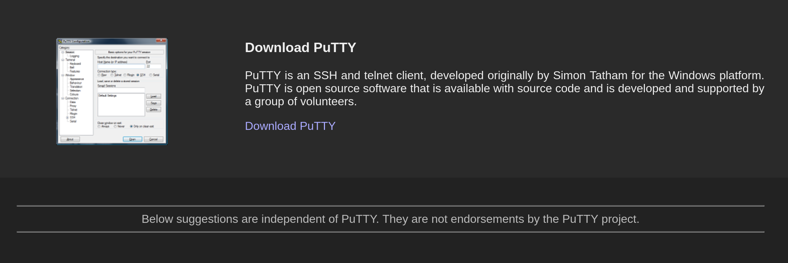
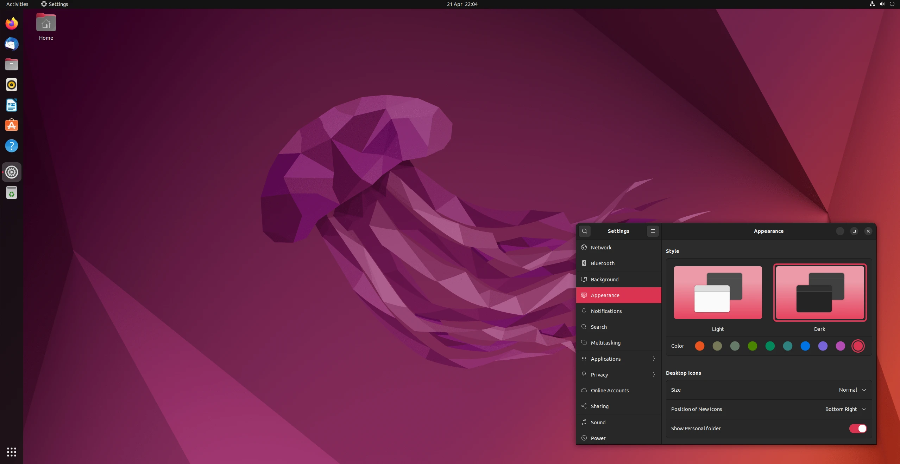
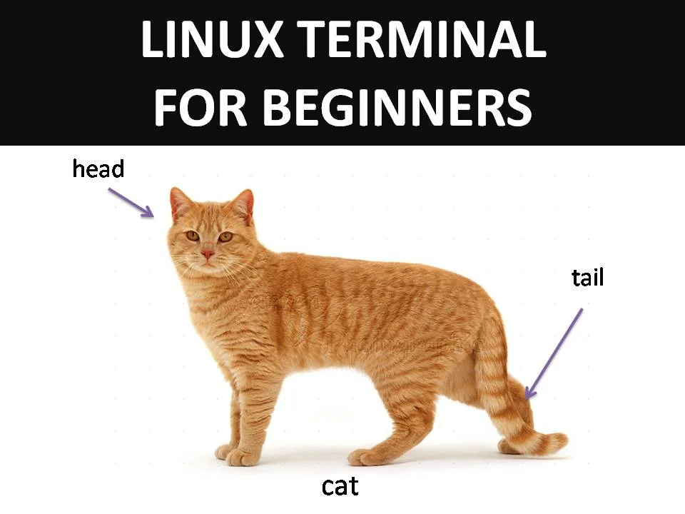
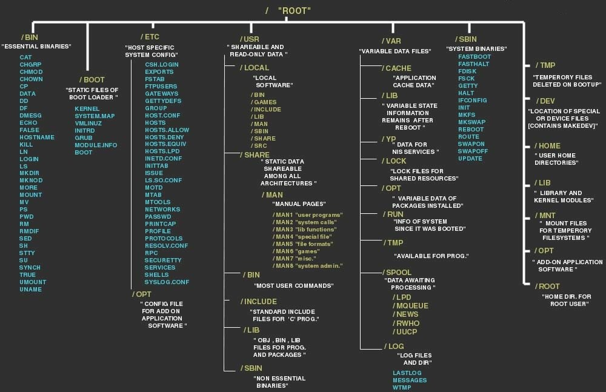
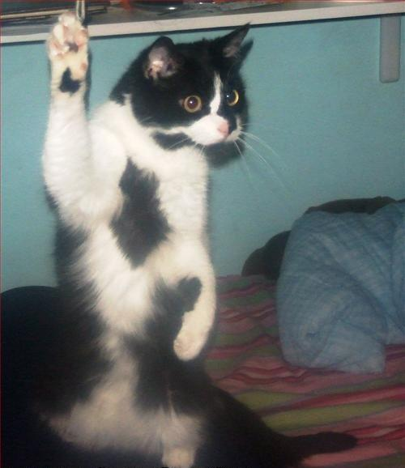

<style>
footer {
  color: #35FF69;
}
ul {
  list-style: none;
}
ul li::before {
  content: "\2022";
  color: #F96900;
  font-weight: bold;
  display: inline-block;
  width: 1em;
}
</style>

# Instalujemy Putty/SSH


```
https://www.putty.org/ # Windows/Linux/MacOS w aplikacji okienkowej
ssh # MacOS/Linux w terminalu
```

PS. Uwaga na kable!

---

# Obsługa terminala Linux

Borys Łangowicz

<!-- _class: lead -->


---
<!-- _class: lead -->
# Co to jest Linux?
---


---


---
<!-- Jak wiele ich jest wg. truelist.co -->
<!-- _class: lead -->
# Ponad 600 rozwijanych dystrybucji


---


---


---



---


---


---
# Ale kto tego używa?
* Wszystkie spośród 500 najmocniejszych superkomputerów
* 85% smartfonów
* 96.3% z 1 000 000 topowych webserwerów
* Około 90% spółek z Fortune 500

 ---


1. Przy użyciu ssh
  ```bash
  ssh użytkownik@edu.halpress.team
  ```

2. Putty (Pobieramy jeśli nie mamy)

  * Wybieramy SSH Access
  * Server IP Address: edu.halpress.team
  * SSH port: 22
  * SSH username: nazwa użytkownika
  * SSH password: hasło

---
<!-- _class: lead -->
# Podstawowe komendy


---

<!-- _class: lead -->

# Zmiana hasła
```
passwd
```

---
# man, --help, apropos, info, help


```bash
man polecenie
polecenie --help 
apropos słowo_kluczowe
info polecenie
help polecenie
```

---
# Kim jesteśmy? Dokąd zmierzamy? 

```bash
whoami # jako kto jestem zalogowany
whatis # opis programu
whereis # gdzie są pliki programu
finger user # informacje o użytkowniku
w # zalogowani użytkownicy
```

```
USER     TTY      FROM             LOGIN@   IDLE   JCPU   PCPU WHAT
neloduka :1       :1               pią15   ?xdm?   6:53m  0.01s /usr/lib/gdm3/gdm-x-session --run-script env GNOME_SHELL_SESS
```

---
## Poruszanie się

```bash
cd # przejście do innego katalogu
ls # pokazywanie zawartości katalogu
pwd # pokazywanie ścieżki do obecnego katalogu
mkdir # tworzenie katalogu
~ = /home/user
``` 
Przykłady
```bash
cd ~
cd ../..
ls /home/user
mkdir katalog
cd -
```

---


## Argumenty/parametry
```bash
ls -l --all
ls -la
tree -L 1
```

```
total 144
drwxrwxr-x  4 neloduka_sobe neloduka_sobe   4096 lut 26 01:29 .
drwxrwxrwx 27 neloduka_sobe neloduka_sobe   4096 lut 20 20:15 ..
-rw-rw-r--  1 neloduka_sobe neloduka_sobe    529 lut 26 01:26 copying_demo.html
drwxrwxr-x  8 neloduka_sobe neloduka_sobe   4096 lut 21 22:21 .git
drwxrwxr-x  2 neloduka_sobe neloduka_sobe   4096 lut 26 14:21 graphics
-rw-rw-r--  1 neloduka_sobe neloduka_sobe    189 lut 21 22:20 Makefile
-rw-rw-r--  1 neloduka_sobe neloduka_sobe     55 lut 20 20:15 README.md
-rw-rw-r--  1 neloduka_sobe neloduka_sobe 107865 lut 27 09:01 slides.html
-rw-rw-r--  1 neloduka_sobe neloduka_sobe   4260 lut 27 09:01 slides.md
```

---
# Zadania
* Założcie w swoim home katalog Ala, następnie w nim katalog ma, wewnątrz katalogu ma utworzyć katalogi kota i psa
* Przejdźcie do katalogu ./Ala/ma/kota i załóżcie podobną strukturę katalogów dla Oli bez używania komendy cd. Sprawdźcie strukturę katalogów
* Przejdzcie do najniższego katalogu, następnie z jego wnętrza wypiszcie pliki i katalogi z katalogu znajdującego się 2 poziomy wyżej

---

## Tworzenie/czytanie plików

```bash
touch # Tworzenie pliku/zmiana daty ostatniej edycji
cat # Czytanie zawartości pliku
cp # Kopiowanie katalogu/pliku
mv # Przenoszenie katalogu/pliku
rm # Usuwanie pliku
```
Przykłady
```bash
touch nazwa_pliku.txt
cp ścieżka_do_pliku ścieżka_kopii
cp ścieżka_do_pliku ścieżka_docelowa
rm przyklad.txt
rm -rf test
```

---

# Zadania
* Usuńcie katalog Ali wraz z podkatalogami
* Utwórzcie plik ‘starocie.txt’ w taki sposób, aby polecenie ‘ls -l’ pokazywało, że został on założony 1 stycznia 1999 roku.
* Zmieńcie nazwę pliku 'starocie.txt' na 'odgrzewany_kotlet.txt'
* Usuńcie plik 'odgrzewany_kotlet.txt'
---

# Przekierowania poleceń
```bash
ls -la > plik.txt # Przekierowanie STDOUT do pliku
pwd >> plik2.txt # Dopisanie STDOUT do pliku
ls nieistniejący_katalog 2> error.txt # Przekierowanie STDERR do pliku
komenda > wyjscie.txt 2> błędy.txt
cat plik | sorted | factor | cowsay   # pipe 
```

```
 _____________
< Code Meet 6 >
 -------------
        \   ^__^
         \  (oo)\_______
            (__)\       )\/\
                ||----w |
                ||     ||
```

---
# Zadania
* Zapiszcie kalendarz z roku 2000 do pliku kalendarz.txt
* Posortujcie zawartość jakiegokolwiek pliku tekstowego w porządku alfabetycznym, a następnie napisz podobną komendę, lecz sortującą zawartość numerycznie
* Dodaj do pliku kalendarz.txt wynik polecenia ls z argumentami: wyświetlającymi wszystkie pliki i posortowane po czasie stworzenia.
---

# Własność pliku, grupy, użytkownicy

```bash
sudo chown user:group file/directory # Zmiana właściciela i grupy
sudo chmod 777 file/directory # zmiana uprawnień
sudo chmod a-rwx file/directory # zmiana uprawnień
```

```
-rw-rw-r-- 1 neloduka_sobe neloduka_sobe    529 lut 26 01:26 copying_demo.html
drwxrwxr-x 2 neloduka_sobe neloduka_sobe   4096 lut 28 21:34 exercises
drwxrwxr-x 2 neloduka_sobe neloduka_sobe   4096 lut 28 21:11 graphics
-rw-rw-r-- 1 neloduka_sobe neloduka_sobe    189 lut 21 22:20 Makefile
-rw-rw-r-- 1 neloduka_sobe neloduka_sobe 493766 gru 23  2021 pan-tadeusz.txt
-rw-rw-r-- 1 neloduka_sobe neloduka_sobe     55 lut 20 20:15 README.md
-rw-rw-r-- 1 neloduka_sobe neloduka_sobe 119410 mar  1 21:07 slides.html
-rw-rw-r-- 1 neloduka_sobe neloduka_sobe   7073 mar  1 21:07 slides.md
```

---
# Lepki bit
```bash
sudo chmod a+t file/directory # nadanie lepkiego bitu dla pliku
sudo chmod 1777 file/directory # nadanie lepkiego bitu dla pliku
```

```
drwxrwxrwt 2 user user 4096 Nov  5 01:33 katalog
```

---
# Edytory
```bash
nano 
vim
gedit # desktop
```


---
# Procesy
```bash
top # pokazywanie procesów
ps aux # aktualny stan procesów
killall # zabij procesy związane z programem
kill # zabij proces
xkill # zabij proces klikając w okno (desktop)
```
Przykład
```
USER         PID %CPU %MEM    VSZ   RSS TTY      STAT START   TIME COMMAND
neloduk+  220389  0.0  0.0  37780 10696 pts/3    S<+  lut28   0:02 vim slides.md
neloduk+  257782  0.0  0.0  23180  5152 pts/7    S<s  20:54   0:00 bash
neloduk+  257856  0.0  0.0  23792  3268 pts/7    R<+  20:56   0:00 ps aux
```
---
## Przeszukiwanie i porównywanie plików

```bash
grep # narzędzie do wyszukiwania wzorców
wc # word count - policz słowa/linie itp.
diff # porównywanie dwóch plików
uniq # zwraca lub pomija powtarzające się linie
cmp # porównywanie dwóch plików
```

```
diff pan-tadeusz.txt  pan-tadeusz-cp.txt 
49,51d48
< Topoli, co go bronią od wiatrów jesieni.
< Dom mieszkalny niewielki, lecz zewsząd chędogi,
< I stodołę miał wielką, i przy niej trzy stogi
```

---

# Pan Tadeusz
> W "Panu Tadeuszu" Adama Mickiewicza wielokrotnie pada słowo "ostatni", którym narrator podkreśla, że świat, który opisał należy do przeszłości. Epopeja jest opowieścią o ostatnim zajeździe na Litwie. 

### Sprawdźmy, czy poloniści się mylili!

aby pobrać plik:
`wget https://wolnelektury.pl/media/book/txt/pan-tadeusz.txt`

---
# Lokalizowanie plików

```bash
locate # podstawowe lokalizowanie pliku
sudo updatedb
find # zaawansowane wyszukiwanie plików
```

```
neloduka_sobe@paula:~/public_html$ find /var/log -name *.log 2> /dev/null

/var/log/cloud-init-output.log
/var/log/update.log
/var/log/ufw.log
/var/log/auth.log
/var/log/alternatives.log
/var/log/apt/history.log
```

---
# Zdania

* Znajdźcie w katalogu / pliki bez uprawnień 777
* Znajdźcie w katalogu / wszystkie pliki wykonywalne
* Napiszcie komendę wypisującą ilość pustych plików txt w katalogu
* Sprawcie, żeby komenda dodatkowo usuwała te pliki
* Napiszcie komendę, która wyczyści wszystkie pliki o rozszerzeniu .log w katalogu
* Napiszcie komendę, która pokaże wszystkie ścieżki zawierające słowo vim, ale nie zawierają słowa lib.
---
# Czytanie pilków
```bash
cat # Zwraca zawartość pliku
tail # Zwraca końcową zawartość pliku
head # Zwraca początkową zawartość pliku
less # Wygodniejszy do przeglądania niż cat
```


---
# Sprawdzanie wolnego miejsca
```bash
du # Zwraca zużycie pamięci przez pliki
df # Zwraca zużycie pamięci
free # Ilość wolnej pamięci RAM
```
```
Filesystem     1K-blocks      Used Available Use% Mounted on
udev             8049264         0   8049264   0% /dev
tmpfs            1623948      2308   1621640   1% /run
/dev/nvme0n1p2  80056888  70792756   5151752  94% /
/dev/nvme0n1p1    510980    293276    217704  58% /boot/efi
/dev/nvme0n1p4 409492012 242623592 145993928  63% /home
```

---
# Zadania
* Jaki filesystem zajmuje najwięcej miejsca na serwerze. Podajcie wynik w czytelnym dla człowieka rozmiarze
* Napiszcie komendę, która zwraca najobszerniejszy spośród katalogów w katalogu, w którym jesteście w czytelnym dla człowieka formacie

---
# Skrypty

```
#!/bin/bash

read -p "Podaj nazwę katalogu: " name
if [[ ! -d  $name ]];
then
  mkdir $name
fi
```

```
http://code.kopernik-leszno.pl/data/files/22/karta-pomocy-bash.pdf
```

---
# Shellcheck
```
cd $WORKNG_DIR
^------------^ SC2164: Use 'cd ... || exit' or 'cd ... || return' in case cd fails.
   ^---------^ SC2153: Possible misspelling: WORKNG_DIR may not be assigned, but WORKING_DIR is.
   ^---------^ SC2086: Double quote to prevent globbing and word splitting.

Did you mean: 
cd "$WORKNG_DIR" || exit


In bad.sh line 49:
	mv config old.config.`date +%s`
                             ^--------^ SC2046: Quote this to prevent word splitting.
                             ^--------^ SC2006: Use $(...) notation instead of legacy backticked `...`.
```

---
# .bashrc

```bash 
cat ~/.bashrc
```
```
export PS1=
"🎅\[\e[33;41m\][\[\e[m\]\[\e[32m\]\u\[\e[m\]\[\e[36m\]@\[\e[m\]\[\e[34m\]\h\[\e[m\]\[\e[33;41m\]]\[\e[m\]🎄 "
alias ll="ls -alF"
alias count='find . -type f | wc -l'
```

```
bashrcgenerator.com
```


---

<!-- _class: lead -->
# Appendix


---



---

# (Prawie) Wszystko jest plikiem

```bash
cd /sys/class/leds/tpacpi::lid_logo_dot
echo 0 | sudo tee brightness 
echo 1 | sudo tee brightness 
```

---
# Instalowanie


* DualBoot
* Jeden system na starym dysku/komputerze
* Wirtualizajca lokalna - VMware, VirtualBox, Docker, itp.
* Wirtualizacja w chmurze - zakup VPS'a
* Linux w przeglądarce przez WebAssembly - straszliwie wolne
* Linux subsystem for Windows
* A może Unix? - MacOS

---

# Aktualizowanie i instalowanie pakietów w apt
```bash
# Aktualizowanie
sudo apt update
sudo apt upgrade
sudo apt dist-upgrade

# Instalowanie
sudo apt install nazwa_pakietu

# Odinstalowywanie
sudo apt remove nazwa_pakietu
```

---

# Czego nie robić?

* Uruchamiać skryptów/komend bez zrozumienia
* Uruchamiać wszystkiego na roocie
* Nie być świadomym, że coś może pójść nie tak
* Sprawdzajcie co kopiujecie


---

# Czy wiesz co wykonasz?
```html
<html>
<!-- Źródło: https://blog.aptmasterclass.com/post/czy-ctrl-c-i-ctrl-v-moga-byc-grozne/ -->
<script>
document.addEventListener('copy', function(e) {
    if (appendOnCopy = (e.target.getAttribute("appendOnCopy"))) {
        var clipboardData = e.clipboardData || window.clipboardData;
        clipboardData.setData('text', e.target.value + appendOnCopy + "\n"); 
        e.preventDefault();
    }
});
</script>
<input type="text" readonly="readonly" value="echo 'Code Meet 6'" appendOnCopy="; cat /etc/passwd" />
</html>
```

---

# Gdzie szukać wiedzy?


* Stackoverflow
* Strony hackerspace'ów
<!-- Hackerspace Silesia -->
* Dokumentacja i kod źródłowy
* Spisy darmowych kursów/książek na githubie
* Platformy pokroju TryHackMe/HackTheBox
* Youtube

---
<!-- _class: lead -->
# Koniec Gadania

---
# Pytania?


---
### Źródła
1. pixabay.com
2. blogs.vmware.com
3. distrowatch.com
4. sailfishos.org
5. enterpriseappstoday.com
6. fortune.com
7. blog.aptmasterclass.com
8. ubuntu.com
9. superuser.com
